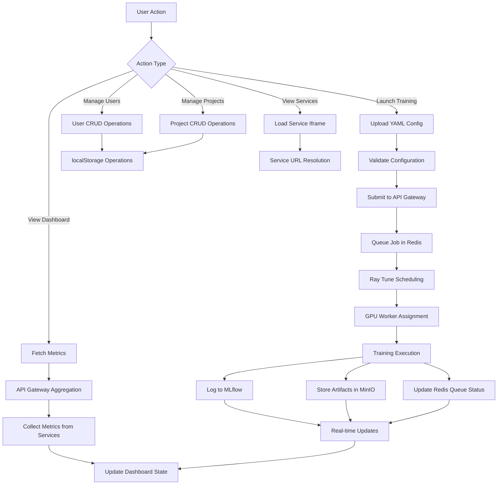
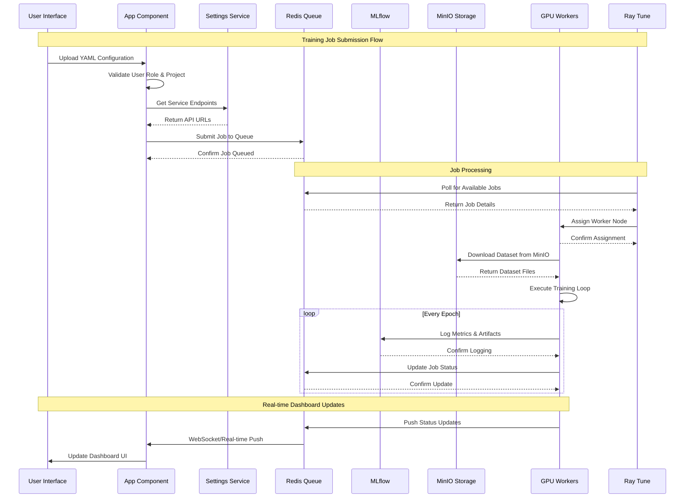
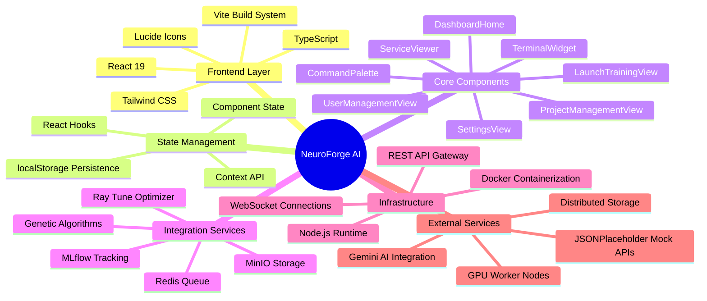

# 🧠 NeuroForge AI

<div align="center">
  
  
  **Advanced AI Training Orchestration Platform**
  
  Centralized command center for distributed YOLO model training with genetic algorithms and intelligent resource management
</div>

---

## 📋 Project Overview

NeuroForge AI is a sophisticated web-based platform designed to orchestrate complex machine learning training workflows across distributed GPU clusters. Built with React and TypeScript, it serves as a centralized hub for managing YOLO (You Only Look Once) model training, experiment tracking, resource monitoring, and team collaboration.

The platform bridges the gap between raw computational power and intelligent model evolution by providing a unified interface for:
- **Distributed Training Management**: Coordinate training jobs across multiple GPU nodes
- **Genetic Algorithm Optimization**: Automatically evolve hyperparameters using evolutionary strategies
- **Real-time Monitoring**: Track cluster performance, GPU utilization, and training progress
- **Team Collaboration**: Manage user access, project namespaces, and experiment tracking
- **Infrastructure Integration**: Seamlessly connect with MLflow, MinIO, Redis, and Ray Tune

---

### 1. 🚶 Diagram Walkthrough (Main Process Flow)



### 2. 🗺️ System Workflow (Detailed Event Sequence)



### 3. 🏗️ Architecture Components



### 4. ⚙️ Container Lifecycle

#### Build Process

1. **Base Image Selection**: `node:18-alpine` for minimal footprint
2. **Dependency Installation**: Copy `package*.json` and run `npm install`
3. **Source Code Copy**: Copy entire application source
4. **Build Execution**: Run `npm run build` to create optimized production assets
5. **Asset Optimization**: Vite bundles React components, TypeScript, and CSS
6. **Final Image**: Multi-stage build results in minimal production image

#### Runtime Process

1. **Container Startup**: Docker container starts with Node.js runtime
2. **Environment Loading**: Load environment variables from `.env` file
3. **Static Asset Serving**: Vite preview server serves built assets from `/app/dist`
4. **Port Binding**: Internal port 4173 bound to external port 5810
5. **Application Initialization**: React app loads in browser
6. **Splash Screen**: 2.8-second splash screen displays
7. **State Restoration**: Load user preferences from localStorage
8. **Service Discovery**: Resolve microservice URLs from configuration
9. **API Initialization**: Establish connections to external services
10. **Ready State**: Application fully operational and responsive

### 5. 📂 File-by-File Guide

| File/Folder | Purpose & Content |
|-------------|-------------------|
| **App.tsx** | Main application component with state management and routing logic |
| **index.tsx** | React application entry point and DOM mounting |
| **index.html** | HTML template with meta tags and root element |
| **types.ts** | TypeScript type definitions for interfaces and enums |
| **constants.tsx** | Application constants, default data, and API configurations |
| **package.json** | Dependencies, scripts, and project metadata |
| **tsconfig.json** | TypeScript compiler configuration and build options |
| **vite.config.ts** | Vite build tool configuration and plugins |
| **Dockerfile** | Multi-stage container build instructions |
| **docker-compose.yaml** | Container orchestration with port mapping and environment |
| **.env** | Environment variables and API keys (user-created) |
| **components/** | React components directory |
| ├── **AboutView.tsx** | Developer profile and system information display |
| ├── **ApiDocsView.tsx** | API documentation viewer component |
| ├── **CommandPalette.tsx** | Quick search and navigation interface |
| ├── **DashboardHome.tsx** | Main dashboard with real-time metrics and job monitoring |
| ├── **DataIngestionView.tsx** | Data upload and management interface |
| ├── **Header.tsx** | Top navigation bar with theme toggle and user info |
| ├── **LaunchTrainingView.tsx** | Training job submission with YAML configuration |
| ├── **PresentationMode.tsx** | Full-screen presentation component |
| ├── **ProjectManagementView.tsx** | Project CRUD operations interface |
| ├── **SearchableSelect.tsx** | Dropdown search component with filtering |
| ├── **ServiceViewer.tsx** | Microservice iframe viewer component |
| ├── **SettingsView.tsx** | Configuration management and service URL setup |
| ├── **Sidebar.tsx** | Navigation sidebar with service list and favorites |
| ├── **SplashScreen.tsx** | Loading splash screen with animations |
| ├── **TerminalWidget.tsx** | Integrated command-line interface widget |
| └── **UserManagementView.tsx** | User CRUD operations and role management |
| **docs/** | Documentation assets and static resources |
| └── **sources/** | Images, logos, and documentation media files |

---

## ✨ Key Features

### 🎯 Core Functionality
- **Dashboard Overview**: Real-time telemetry from distributed training clusters
- **Launch Training**: Deploy new experiments with YAML configuration files
- **Project Registry**: Manage experiment namespaces and project lifecycles
- **User Management**: Role-based access control (Admin/Guest roles)
- **API Reference**: Comprehensive REST API documentation

### 🔧 Infrastructure Integration
- **MLflow Tracking**: Experiment logging, metrics, and artifact storage
- **MinIO Storage**: High-performance object storage for datasets and models
- **Redis Queue**: Job orchestration and task scheduling
- **Genetic Optimization**: Hyperparameter tuning with evolutionary algorithms
- **Ray Tune**: Scalable hyperparameter optimization with massive parallelism

### 🎨 User Experience
- **Dark/Light Theme**: Toggle between visual themes
- **Command Palette**: Quick navigation with Cmd/Ctrl+K
- **Terminal Widget**: Integrated command-line interface
- **Presentation Mode**: Full-screen presentation capabilities
- **Responsive Design**: Optimized for desktop and mobile devices

---

## 🚀 Getting Started

### Prerequisites
- **Node.js** (v18 or higher)
- **npm** or **yarn** package manager
- **Docker** and **Docker Compose** (for containerized deployment)

### Local Development Setup

1. **Clone the Repository**
   ```bash
   git clone <repository-url>
   cd NeuralForgeAI
   ```

2. **Install Dependencies**
   ```bash
   npm install
   ```

3. **Environment Configuration**
   ```bash
   # Copy the environment template
   cp .env.example .env
   
   # Edit the .env file with your configuration
   nano .env
   ```

4. **Start Development Server**
   ```bash
   npm run dev
   ```

5. **Access the Application**
   - Open your browser and navigate to `http://localhost:5173`
   - The splash screen will display for 2.8 seconds before loading the main interface

### Docker Deployment

1. **Build and Run with Docker Compose**
   ```bash
   docker-compose up --build -d
   ```

2. **Access the Application**
   - Navigate to `http://localhost:5810`
   - The application runs in production mode using the built assets

---

## 📁 File Structure

```
NeuralForgeAI/
├── components/                 # React Components
│   ├── AboutView.tsx          # About/Developer information
│   ├── ApiDocsView.tsx        # API documentation viewer
│   ├── CommandPalette.tsx     # Quick search navigation
│   ├── DashboardHome.tsx      # Main dashboard with metrics
│   ├── DataIngestionView.tsx   # Data upload/management
│   ├── Header.tsx              # Top navigation bar
│   ├── LaunchTrainingView.tsx  # Training job submission
│   ├── PresentationMode.tsx   # Full-screen presentation
│   ├── ProjectManagementView.tsx # Project CRUD operations
│   ├── SearchableSelect.tsx    # Dropdown search component
│   ├── ServiceViewer.tsx       # Microservice iframe viewer
│   ├── SettingsView.tsx        # Configuration management
│   ├── Sidebar.tsx             # Navigation sidebar
│   ├── SplashScreen.tsx        # Loading splash screen
│   ├── TerminalWidget.tsx      # Integrated terminal
│   └── UserManagementView.tsx   # User CRUD operations
├── docs/                       # Documentation assets
│   └── sources/               # Images and logos
├── App.tsx                    # Main application component
├── constants.tsx              # Application constants and defaults
├── types.ts                   # TypeScript type definitions
├── index.html                 # HTML entry point
├── index.tsx                  # React application entry
├── package.json               # Dependencies and scripts
├── tsconfig.json              # TypeScript configuration
├── vite.config.ts             # Vite build configuration
├── docker-compose.yaml        # Docker orchestration
├── Dockerfile                 # Container build instructions
└── .env                       # Environment variables (create this)
```

---

## ⚙️ Configuration

### Environment Variables

Create a `.env` file in the root directory with the following variables:

```bash
# Required: Google Gemini API Key for AI integration
GEMINI_API_KEY=your_gemini_api_key_here

# Optional: Custom API endpoints
UPLOAD_API_URL=https://your-api-endpoint.com/upload
DASHBOARD_API_URL=https://your-dashboard-api.com
```

### Default Configuration

The application includes sensible defaults for:

- **Microservices**: Pre-configured services (MLflow, MinIO, Redis, etc.)
- **Users**: Default admin and guest accounts
- **Projects**: Sample YOLO training projects
- **API Endpoints**: Mock endpoints for demonstration

### Service URLs

Microservice URLs can be configured through the Settings interface:
- Navigate to **Settings** → **Service Configuration**
- Update URLs for each microservice
- Changes are automatically persisted to localStorage

---

## 📖 Usage Examples

### Launching a Training Job

1. **Navigate to Launch Training**
   - Click "Launch Training" in the sidebar
   - Select your user profile from the dropdown
   - Choose the target project

2. **Upload Configuration**
   ```yaml
   debug: wisrovi
   model: "yolov8n-cls.pt"
   
   train:
     data: /datasets/clasificacion/colorball.v8i.multiclass/
     epochs: 20
     imgsz: 640
   
   sweeper:
     version: 2
     study_name: "example_classification"
     n_trials: 5
     search_space:
       model: ["choice", "yolov8n-cls.pt"]
       train:
         imgsz: ["choice", 416, 512, 640]
         lr0: ["loguniform", 1e-5, 1e-2]
   ```

3. **Submit Job**
   - Drag and drop the YAML file or click to browse
   - Click "Launch Training Job"
   - Monitor progress in the Dashboard

### Managing Users and Projects

1. **User Management** (Admin only)
   - Navigate to **Team Access** in the sidebar
   - Add, edit, or remove user accounts
   - Assign roles (Admin/Dev)

2. **Project Management** (Admin only)
   - Navigate to **Project Registry**
   - Create new experiment namespaces
   - Track project lifecycles

### Using the Command Palette

- **Keyboard Shortcut**: Press `Cmd+K` (Mac) or `Ctrl+K` (Windows/Linux)
- **Quick Navigation**: Search for any service or setting
- **Theme Toggle**: Switch between dark and light modes
- **Terminal Access**: Open the integrated terminal widget

---

## 🔧 Development Commands

### Available Scripts

```bash
# Development
npm run dev          # Start development server with hot reload
npm run build        # Build for production
npm run preview      # Preview production build locally

# Docker
docker-compose up --build -d    # Build and run containers
docker-compose down              # Stop and remove containers
docker-compose logs -f app       # View application logs
```

### TypeScript Configuration

The project uses strict TypeScript configuration:
- **Target**: ES2020
- **Module**: ESNext
- **Strict Mode**: Enabled
- **React Support**: JSX with React 19

---

## 🐳 Docker Configuration

### Multi-stage Build

The Dockerfile uses a multi-stage build process:

1. **Builder Stage**: 
   - Uses Node.js 18 Alpine
   - Installs dependencies and builds the application
   - Optimizes for layer caching

2. **Production Stage**:
   - Serves built assets with Vite preview
   - Exposes port 4173 internally
   - Configured for 0.0.0.0 host binding

### Container Orchestration

```yaml
version: '3.8'
services:
  app:
    build: .
    image: wisrovi/neuralforgeai:latest
    ports:
      - "5810:4173"
    environment:
      - GEMINI_API_KEY=${GEMINI_API_KEY}
    env_file:
      - .env
```

---

## 🤝 Contributing

### Development Guidelines

1. **Code Style**: Follow existing TypeScript and React patterns
2. **Component Structure**: Maintain consistent component organization
3. **State Management**: Use React hooks for local state, localStorage for persistence
4. **API Integration**: Follow the existing API configuration patterns
5. **Testing**: Add unit tests for new components and utilities

### Submitting Changes

1. Fork the repository
2. Create a feature branch: `git checkout -b feature-name`
3. Commit changes: `git commit -m 'Add feature description'`
4. Push to branch: `git push origin feature-name`
5. Submit a pull request

---

## 📄 License

This project is licensed under the MIT License - see the LICENSE file for details.

---

## 🙋‍♂️ Support

For questions, issues, or contributions:

- **Developer**: Wisrovi Rodríguez
- **Email**: wisrovi@neuroforge.ai
- **LinkedIn**: [Wisrovi Rodríguez](https://www.linkedin.com/in/wisrovi-rodriguez/)
- **Issues**: Report bugs and feature requests via GitHub Issues

---

## 🎯 Future Roadmap

### Planned Enhancements

- **Real-time Collaboration**: Multi-user dashboard sharing
- **Advanced Analytics**: ML-powered insights and recommendations
- **Cloud Provider Integration**: AWS, GCP, Azure native deployments
- **Mobile Application**: Native iOS/Android apps
- **Plugin System**: Extensible architecture for custom integrations
- **Advanced Security**: SSO, OAuth 2.0, and audit logging

### Technology Stack Evolution

- **Backend Services**: Microservices with gRPC
- **Database**: PostgreSQL for metadata, TimescaleDB for metrics
- **Message Queue**: Apache Kafka for event streaming
- **Monitoring**: Prometheus + Grafana for observability
- **CI/CD**: GitHub Actions with automated testing and deployment

---

<div align="center">
  <strong>🚀 Built with passion for AI infrastructure and distributed computing 🚀</strong>
</div>