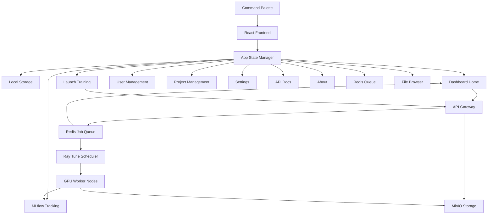
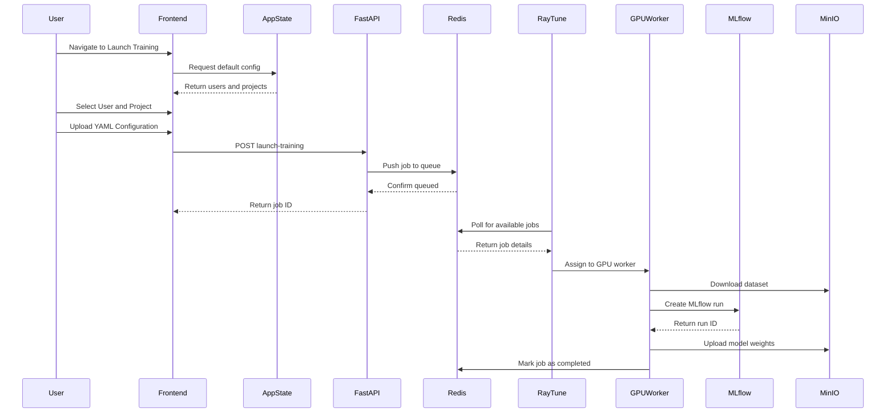
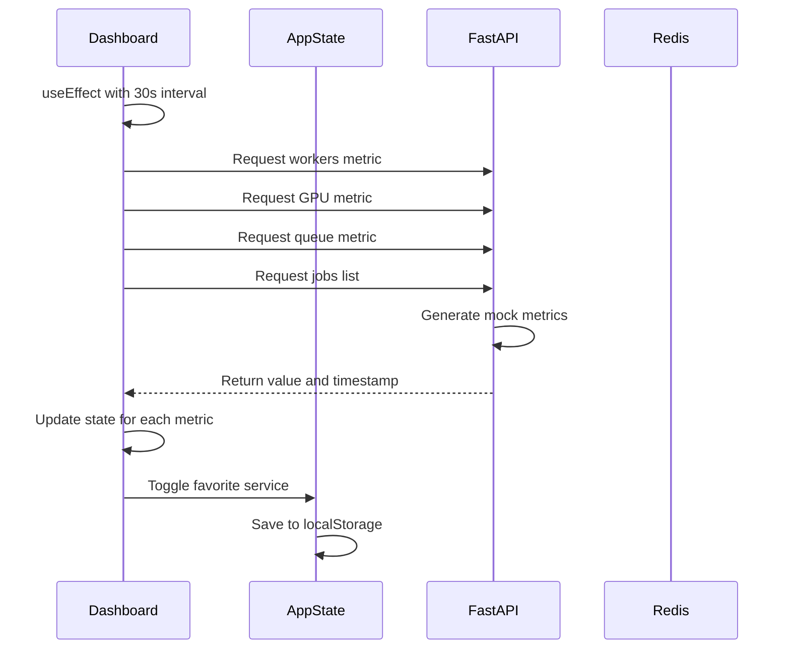
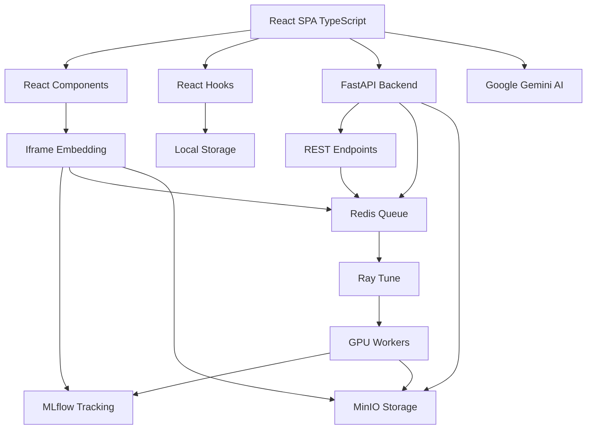
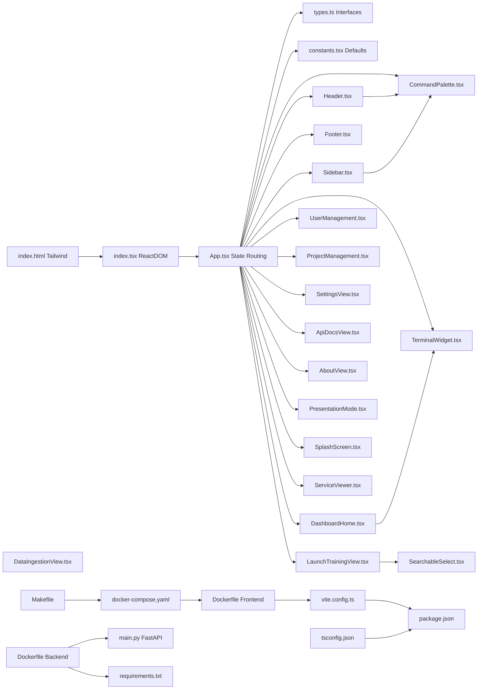
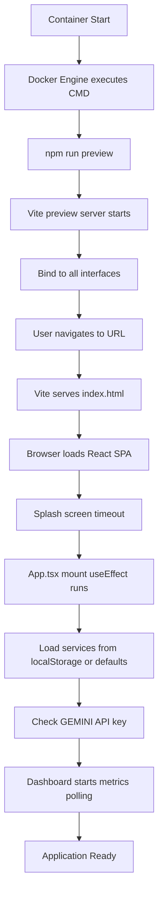

# W-Darwin Ops by NeuroForge AI

<div align="center">
  
  
  **Evolutionary Orchestration System for Remote YOLO Training**
  
  Centralized command center for distributed YOLO model training, genetic optimization, and ML lifecycle management
</div>

---

## Project Overview

**W-Darwin Ops** (also branded as **NeuroForge AI**) is a sophisticated web-based orchestration platform designed to manage complex machine learning training workflows across distributed GPU clusters. Built with React 19 and TypeScript, it serves as a unified hub for YOLO (You Only Look Once) model training, experiment tracking, resource monitoring, and team collaboration.

### Core Capabilities

- **Distributed Training Management**: Coordinate training jobs across multiple GPU worker nodes
- **Genetic Algorithm Optimization**: Automatically evolve hyperparameters using evolutionary strategies
- **Real-time Monitoring**: Track cluster performance, GPU utilization, and training progress
- **Team Collaboration**: Role-based access control with project namespace management
- **Infrastructure Integration**: Native connectivity with MLflow, MinIO, Redis Queue, and Ray Tune

---

## System Architecture

### Main Process Flow Diagram


```mermaid
graph TD
    A[React Frontend] --> B[App State Manager]
    C[Command Palette] --> A
    B --> D[Local Storage]
    B --> E[Dashboard Home]
    B --> F[Launch Training]
    B --> G[User Management]
    B --> H[Project Management]
    B --> I[Settings]
    B --> J[API Docs]
    B --> K[About]
    B --> L[MLflow Tracking]
    B --> M[Redis Queue]
    B --> N[File Browser]
    E --> O[API Gateway]
    F --> O
    O --> P[Redis Job Queue]
    O --> Q[MinIO Storage]
    P --> R[Ray Tune Scheduler]
    R --> S[GPU Worker Nodes]
    S --> L
    S --> Q
    P --> E
```

### Training Job Sequence Diagram


```mermaid
sequenceDiagram
    participant User
    participant Frontend
    participant AppState
    participant FastAPI
    participant Redis
    participant RayTune
    participant GPUWorker
    participant MLflow
    participant MinIO

    User->>Frontend: Navigate to Launch Training
    Frontend->>AppState: Request default config
    AppState-->>Frontend: Return users and projects
    User->>Frontend: Select User and Project
    User->>Frontend: Upload YAML Configuration
    Frontend->>FastAPI: POST launch-training
    FastAPI->>Redis: Push job to queue
    Redis-->>FastAPI: Confirm queued
    FastAPI-->>Frontend: Return job ID
    RayTune->>Redis: Poll for available jobs
    Redis-->>RayTune: Return job details
    RayTune->>GPUWorker: Assign to GPU worker
    GPUWorker->>MinIO: Download dataset
    GPUWorker->>MLflow: Create MLflow run
    MLflow-->>GPUWorker: Return run ID
    GPUWorker->>MinIO: Upload model weights
    GPUWorker->>Redis: Mark job as completed
```

### Dashboard Metrics Flow


```mermaid
sequenceDiagram
    participant Dashboard
    participant AppState
    participant FastAPI
    participant Redis

    Dashboard->>Dashboard: useEffect with 30s interval
    Dashboard->>FastAPI: Request workers metric
    Dashboard->>FastAPI: Request GPU metric
    Dashboard->>FastAPI: Request queue metric
    Dashboard->>FastAPI: Request jobs list
    FastAPI->>FastAPI: Generate mock metrics
    FastAPI-->>Dashboard: Return value and timestamp
    Dashboard->>Dashboard: Update state for each metric
    Dashboard->>AppState: Toggle favorite service
    AppState->>AppState: Save to localStorage
```

### System Context Diagram


```mermaid
graph TD
    A[React SPA TypeScript]
    B[React Components]
    C[React Hooks]
    D[Local Storage]
    E[FastAPI Backend]
    F[REST Endpoints]
    G[Iframe Embedding]
    H[MLflow Tracking]
    I[Redis Queue]
    J[MinIO Storage]
    K[Ray Tune]
    L[GPU Workers]
    M[Google Gemini AI]

    A --> B
    A --> C
    C --> D
    A --> E
    E --> F
    B --> G
    E --> I
    E --> J
    F --> I
    G --> H
    G --> I
    G --> J
    I --> K
    K --> L
    L --> H
    L --> J
    A --> M
```

### Component Dependency Graph


```mermaid
graph LR
    A[index.tsx ReactDOM]
    B[index.html Tailwind]
    C[App.tsx State Routing]
    D[types.ts Interfaces]
    E[constants.tsx Defaults]
    F[Header.tsx]
    G[Sidebar.tsx]
    H[CommandPalette.tsx]
    I[Footer.tsx]
    J[DashboardHome.tsx]
    K[LaunchTrainingView.tsx]
    L[UserManagement.tsx]
    M[ProjectManagement.tsx]
    N[SettingsView.tsx]
    O[ApiDocsView.tsx]
    P[AboutView.tsx]
    Q[TerminalWidget.tsx]
    R[PresentationMode.tsx]
    S[SplashScreen.tsx]
    T[ServiceViewer.tsx]
    U[SearchableSelect.tsx]
    V[DataIngestionView.tsx]
    W[vite.config.ts]
    X[tsconfig.json]
    Y[package.json]
    Z[Dockerfile Frontend]
    AA[Dockerfile Backend]
    BB[docker-compose.yaml]
    CC[Makefile]
    DD[main.py FastAPI]
    EE[requirements.txt]

    A --> C
    B --> A
    C --> D
    C --> E
    C --> F
    C --> G
    C --> J
    C --> K
    C --> L
    C --> M
    C --> N
    C --> O
    C --> P
    C --> T
    C --> H
    C --> Q
    C --> R
    C --> S
    C --> I
    F --> H
    G --> H
    K --> U
    J --> Q
    W --> Y
    X --> Y
    Z --> W
    AA --> DD
    AA --> EE
    BB --> Z
    CC --> BB
```

### Docker Build Flow


```mermaid
graph LR
    A[FROM node alpine]
    B[WORKDIR app]
    C[COPY package json]
    D[RUN npm install]
    E[COPY source code]
    F[ARG VITE variables]
    G[ENV VITE variables]
    H[RUN npm run build]
    I[EXPOSE 4173]
    J[CMD npm run preview]
    K[Output Docker Image]

    A --> B
    B --> C
    C --> D
    D --> E
    E --> F
    F --> G
    G --> H
    H --> I
    I --> J
    J --> K
```

### Runtime Startup Flow


```mermaid
graph TD
    A[Container Start] --> B[Docker Engine executes CMD]
    B --> C[npm run preview]
    C --> D[Vite preview server starts]
    D --> E[Bind to all interfaces]
    E --> F[User navigates to URL]
    F --> G[Vite serves index.html]
    G --> H[Browser loads React SPA]
    H --> I[Splash screen timeout]
    I --> J[App.tsx mount useEffect runs]
    J --> K[Load services from localStorage or defaults]
    K --> L[Check GEMINI API key]
    L --> M[Dashboard starts metrics polling]
    M --> N[Application Ready]
```

---

## Core Technical Stack

| Layer | Technologies |
|-------|--------------|
| **Frontend** | React 19.2.1, TypeScript 5.8.2, Vite 6.2.0, Tailwind CSS, Lucide React |
| **Backend** | Python 3.11, FastAPI 0.104.1, Uvicorn, Pydantic |
| **Containerization** | Docker Multi-stage Builds, Docker Compose 3.8 |
| **ML Infrastructure** | MLflow (Tracking), Redis (Queue), MinIO (Storage), Ray Tune (Optimization) |
| **External Services** | Google Gemini AI API |

---

## File-by-File Guide

### Root Level Files

| File/Directory | Purpose & Content |
|----------------|-------------------|
| **App.tsx** | Main application component with comprehensive state management and view routing. Contains useState for theme, role, services, users, projects, favorites, Gemini toggle, splash screen, command palette, and terminal visibility. |
| **index.tsx** | React application entry point. Uses ReactDOM.createRoot() to render App component into DOM element with id root. |
| **index.html** | HTML5 entry point with Tailwind CSS CDN, dark mode class by default, div with id root, and viewport meta tags. |
| **types.ts** | TypeScript type definitions: UserRole, Microservice, ThemeContextType, UserProfile, ProjectDefinition interfaces. |
| **constants.tsx** | Application constants including APP_NAME equals WDarwin Ops, API_BASE, DEFAULT_USERS (3 users), DEFAULT_PROJECTS (4 projects), DEFAULT_MICROSERVICES (12 services), DEVELOPER_PROFILE, PRESENTATION_SLIDES (10 slides), MOCK_LOGS. |
| **package.json** | NPM config: name w-darwin-ops, dependencies: react 19.2.1, react-dom 19.2.1, lucide-react 0.555.0, devDependencies: typescript 5.8.2, vite 6.2.0. Scripts: dev, build, preview. |
| **tsconfig.json** | TypeScript strict mode configuration. Target ES2022, module ESNext, JSX react-jsx, strict enabled, types node and vite/client, paths at alias. |
| **vite.config.ts** | Vite configuration. Uses vitejs/plugin-react, server port 3000, preview port 4173, path alias at to current directory. |
| **Dockerfile** | Multi-stage frontend build. node:18-alpine base, build args VITE_MLFLOW_TRACKING_URI, VITE_REDIS_TRACKING_URL, VITE_FILEBROWSER_URL, VITE_API_URL. Exposes 4173, runs npm run preview with host 0.0.0.0. |
| **docker-compose.yaml** | Service neuroforge-frontend built from current directory, image wisrovi/train_service:w_darwin_ops_frontend_v1.0.0, ports 23432 to 4173, environment with CONTROL_HOST interpolation, env_file control_host.env, network control_network (external). |
| **Makefile** | Docker convenience commands. make start runs docker-compose with env-file control_host.env up -d --build. make stop runs docker-compose with env-file control_host.env down. |
| **control_host.env** | Environment configuration. CONTROL_HOST equals 192.168.1.137, CIFS_USER equals wisrovi, CIFS_PASS equals wyoloservice, GEMINI_API_KEY value present. |

### Components Directory

| Component | Purpose & Content |
|-----------|-------------------|
| **DashboardHome.tsx** | Main dashboard with 8 metric cards (Active Workers, GPU Utilization, Queue Depth, Storage Used, Active Jobs List, Redis Memory, MinIO Bandwidth, ETA Completion). Uses setInterval for polling, mock fetch calls. |
| **LaunchTrainingView.tsx** | Training job submission interface. User or Project selection via SearchableSelect, YAML file upload with drag-and-drop, YAML syntax validation, launch-training POST to API. |
| **UserManagementView.tsx** | CRUD interface for users. Create, Edit, Delete operations on UserProfile array. Role selection: admin or dev. LocalStorage persistence via App state callbacks. |
| **ProjectManagementView.tsx** | CRUD interface for projects. Create, Edit, Delete ProjectDefinition array. Shows name, description, createdAt date. |
| **SettingsView.tsx** | Global configuration. Service URL editor (MLflow, Redis, File Browser, API URL), Gemini AI toggle with API key input, CIFS credentials config. Persists to localStorage. |
| **ApiDocsView.tsx** | Inline REST API documentation viewer. Simulated or generated API docs for training, metrics, jobs endpoints. |
| **AboutView.tsx** | Developer profile display. Shows DEVELOPER_PROFILE data: Wisrovi Rodriguez, Software Engineer and System Architect, LinkedIn link, avatar. |
| **ServiceViewer.tsx** | Iframe-based external service viewer. Loads microservice UIs (MLflow, Redis Queue, Datasets) in sandboxed iframe with fallback or placeholder when service unavailable. |
| **Sidebar.tsx** | Navigation sidebar. Lists all DEFAULT_MICROSERVICES, favorites toggle, role-based visibility (minRole check), collapse or expand, active service highlighting. |
| **Header.tsx** | Top navigation bar. Search icon that opens CommandPalette, theme toggle (sun or moon), user profile dropdown with role indicator. |
| **CommandPalette.tsx** | Quick search or navigation modal. Keyboard shortcut Cmd+K or Ctrl+K. Filter or search services, theme toggle shortcut, terminal toggle. |
| **TerminalWidget.tsx** | Integrated terminal-like log viewer. Displays MOCK_LOGS from constants, auto-scroll, simulated terminal appearance. |
| **PresentationMode.tsx** | Full-screen presentation slideshow. Renders PRESENTATION_SLIDES array (10 slides explaining architecture, YOLO, genetic algorithms, Ray Tune, MinIO, Redis, MLflow, the developer). |
| **SplashScreen.tsx** | Animated loading screen. useEffect with 2800ms timeout, DNA helix logo animation, WDarwin Ops title with subtitle Evolutionary Intelligence. |
| **SearchableSelect.tsx** | Reusable dropdown component with search filter. Used in LaunchTrainingView for user and project selection. |
| **DataIngestionView.tsx** | Data upload and management interface. File upload component for training data ingestion. |
| **Footer.tsx** | Global footer component. Copyright and version information. |

### Backend Directory

| File | Purpose & Content |
|------|-------------------|
| **main.py** | FastAPI backend application (490 lines). app equals FastAPI with title NeuroForge AI Backend. CORS middleware for localhost port 5173 and 5810. Pydantic models: MetricRequest, TrainingJobRequest, DataUploadRequest. mock_jobs array (5 predefined jobs with random mutation). Endpoints: POST posts (generic metrics handler: workers, gpu, queue, storage, jobs_list, redis_mem, minio_bw, eta), POST upload (file upload), POST launch-training (queues training), GET jobs, GET jobs by job_id, GET health, GET mlflow, GET redis, GET filebrowser, GET root. Runs with uvicorn.run on 0.0.0.0 port 8000. |
| **requirements.txt** | Python dependencies: fastapi 0.104.1, uvicorn 0.24.0, python-multipart 0.0.6, pydantic 2.5.0. |
| **Dockerfile** | Backend container build: python:3.11-slim, pip install -r requirements.txt, import test RUN python3 -c "import main;...", exposes 8000, cmd python3 main.py. |

---

## Key Features

### Core Orchestration Features
- **Unified Dashboard**: Real-time telemetry from distributed training clusters with 8 metric visualizations
- **Training Orchestration**: Deploy YOLO training experiments with YAML-based hyperparameter configuration
- **Genetic Optimization**: Built for evolutionary hyperparameter search with mutation, crossover, selection patterns
- **Project Registry**: Namespace-based experiment organization with lifecycle tracking
- **Role-Based Access**: Admin or Dev role system with minRole permission checks on sensitive services

### Infrastructure Integration
- **MLflow Tracking**: Native iframe integration for experiment logging, metrics comparison, and artifact management
- **Redis Queue**: Job orchestration, task scheduling, and real-time status monitoring
- **MinIO Storage**: High-performance object storage for datasets and model weights via File Browser interface
- **Ray Tune Ready**: Architected for scalable hyperparameter optimization with massive parallelism
- **Gemini AI Integration**: Optional Google Gemini AI assistant toggle with API key configuration

### Developer Experience
- **Dark or Light Theme**: Persistent theme toggle stored in localStorage
- **Command Palette**: Cmd or Ctrl + K quick navigation and action system
- **Terminal Widget**: Integrated log viewer with simulated terminal interface
- **Presentation Mode**: Full-screen slideshow for architecture and workflow presentations
- **LocalStorage Persistence**: All user preferences, service URLs, and custom configurations automatically saved

---

## Installation & Setup

### Prerequisites

| Dependency | Version | Purpose |
|------------|---------|---------|
| **Node.js** | v18+ | JavaScript runtime for frontend development |
| **npm** | v9+ | Package manager (included with Node.js) |
| **Docker** | 20.10+ | Container runtime |
| **Docker Compose** | v2.0+ | Container orchestration |
| **Python** | 3.11 | Backend development (optional) |

### Environment Configuration

The application requires specific environment variables for microservice connectivity. The default values assume a control node at 192.168.1.137.

**Create environment file:**

```bash
# Copy and edit the control_host.env file
# The existing file uses defaults for 192.168.1.137
cp control_host.env .env.local
```

### Option 1: Docker Deployment (Recommended)

**Step 1: Build and Start Containers**

```bash
# Using Makefile (simplest)
make start

# Or directly with docker-compose
docker-compose --env-file ./control_host.env up -d --build
```

**Step 2: Stop Containers**

```bash
# Using Makefile
make stop

# Or directly
docker-compose --env-file ./control_host.env down
```

### Option 2: Local Development

```bash
# Install dependencies
npm install

# Start development server
npm run dev

# Start backend (in another terminal)
cd backend/api
pip install -r requirements.txt
python main.py
```

---

## Usage Examples

### Makefile Commands

| Command | Action |
|---------|--------|
| `make start` | Build and start all containers in detached mode |
| `make stop` | Stop and remove containers, networks |

### npm Scripts

| Script | Action |
|--------|--------|
| `npm run dev` | Start Vite development server (HMR enabled) |
| `npm run build` | Build optimized production bundle to dist |
| `npm run preview` | Serve dist using Vite preview server |

### Launching a Training Job

1. Navigate: Click Launch Training in the sidebar
2. Select User: Choose from the dropdown
3. Select Project: Choose target namespace
4. Upload YAML: Drag-and-drop or click to select a .yaml file
5. Submit: Click Launch Training Job
6. Monitor: Return to Dashboard for real-time progress tracking

**Example YAML Configuration:**

```yaml
debug: wisrovi
model: "yolov8n-cls.pt"

train:
  data: /datasets/clasificacion/colorball.v8i.multiclass/
  epochs: 20
  imgsz: 640

sweeper:
  version: 2
  study_name: "example_classification"
  n_trials: 5
  search_space:
    model: ["choice", "yolov8n-cls.pt"]
    train:
      imgsz: ["choice", 416, 512, 640]
      lr0: ["loguniform", 1e-5, 1e-2]
```

---

## API Reference

### Backend Endpoints

| Endpoint | Method | Purpose |
|----------|--------|---------|
| `/` | GET | Root endpoint - returns API info and endpoint list |
| `/posts` | POST | Generic metric endpoint - handles all dashboard polling |
| `/upload` | POST | File upload endpoint |
| `/launch-training` | POST | Submit training job |
| `/jobs` | GET | List all jobs |
| `/jobs/{job_id}` | GET | Get specific job details |
| `/health` | GET | Health check |
| `/mlflow` | GET | MLflow service info |
| `/redis` | GET | Redis Queue service info |
| `/filebrowser` | GET | File Browser service info |

### Default Users

| ID | Name | Email | Role |
|-----|------|-------|------|
| u1 | Wisrovi Rodriguez | wisrovi at darwin-ops.ai | admin |
| u2 | Guest Researcher | guest at darwin-ops.ai | dev |
| u3 | AI Worker Bot | bot-01 at darwin-ops.ai | dev |

### Default Projects

| ID | Name | Description | Created |
|-----|------|-------------|---------|
| p1 | wTicketFlow | Backend-free ticket management | 2025-11-01 |
| p2 | wDarwin Ops | AI Training Orchestration | 2025-12-15 |
| p3 | wAgents | AI development workbench | 2025-11-15 |
| p4 | NexusFlow | Organizational Diagnostic System | 2025-12-01 |

---

## Port Reference

| Port | Service | Interface |
|------|---------|-----------|
| **23432** | Frontend (Vite preview) | Externally accessible |
| **23435** | MLflow Tracking UI | External service |
| **23438** | Redis Queue UI | External service |
| **23442** | Backend API | External service |
| **23448** | File Browser | External service |
| **4173** | Vite preview (internal) | Container-internal only |
| **8000** | FastAPI backend (internal) | Backend container port |
| **5173** | Vite dev server (local) | Only for npm run dev |

---

## Future Roadmap

### Planned Enhancements

- **Real-time Collaboration**: Multi-user dashboard sharing with presence indicators
- **Advanced Analytics**: ML-powered insights and anomaly detection
- **Cloud Provider Integration**: Native AWS, GCP, Azure deployment templates
- **Mobile Application**: Responsive mobile-first interface
- **Plugin System**: Extensible architecture for custom integrations
- **Advanced Security**: SSO, OAuth 2.0, audit logging

---

## License

This project is licensed under the MIT License.

---

## Author

<div align="center">
  
  
  ### William Rodriguez - wisrovi
  
  **Software Engineer & System Architect** | **Technology Evangelist**
  
  Specialized in AI Infrastructure and Orchestration. Creator of W-Darwin Ops, an advanced system for centralized YOLO training using Genetic Algorithms, Ray Tune, and distributed computing patterns.
  
  [](https://www.linkedin.com/in/wisrovi-rodriguez/)
  
  Location: Spain | Email: wisrovi at neuroforge.ai
</div>

---

<div align="center">
  <strong>Built with passion for AI infrastructure and distributed computing</strong>
  
  **W-Darwin Ops** - Where models are not just trained, but evolved.
</div>
