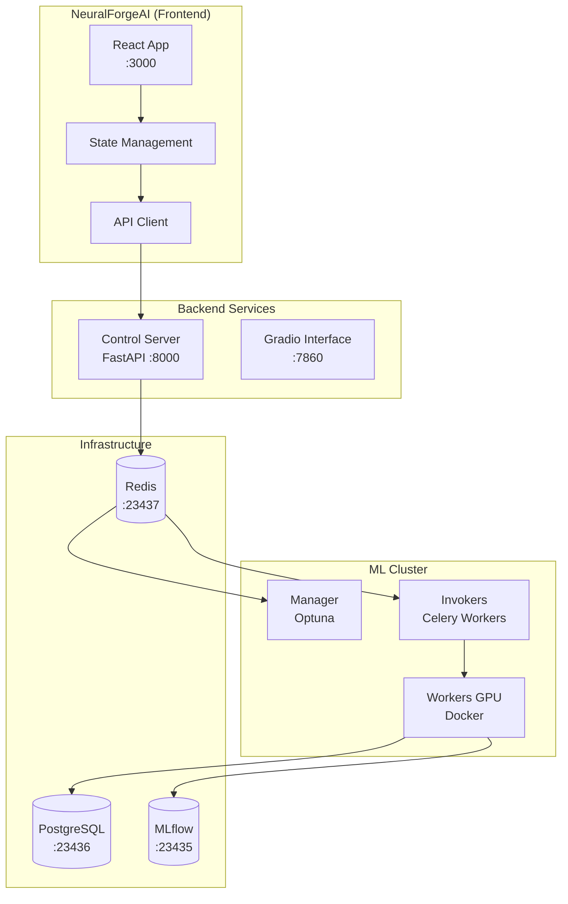
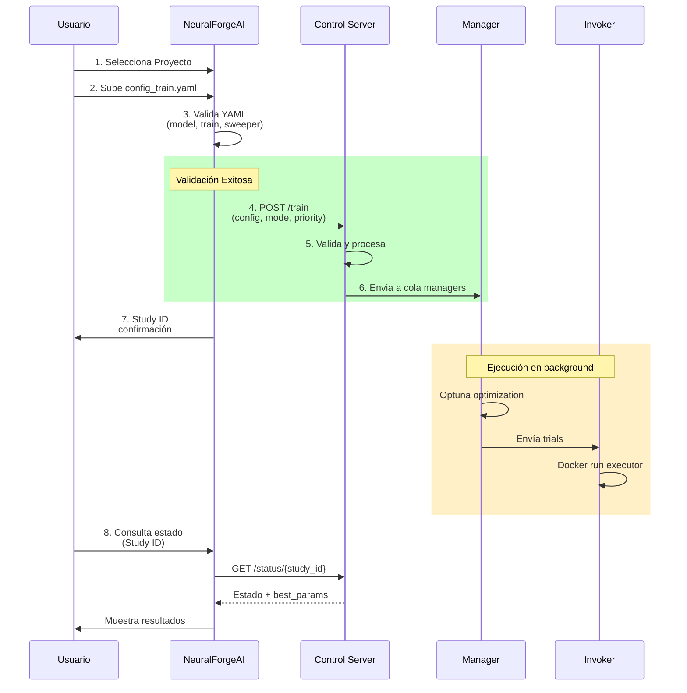
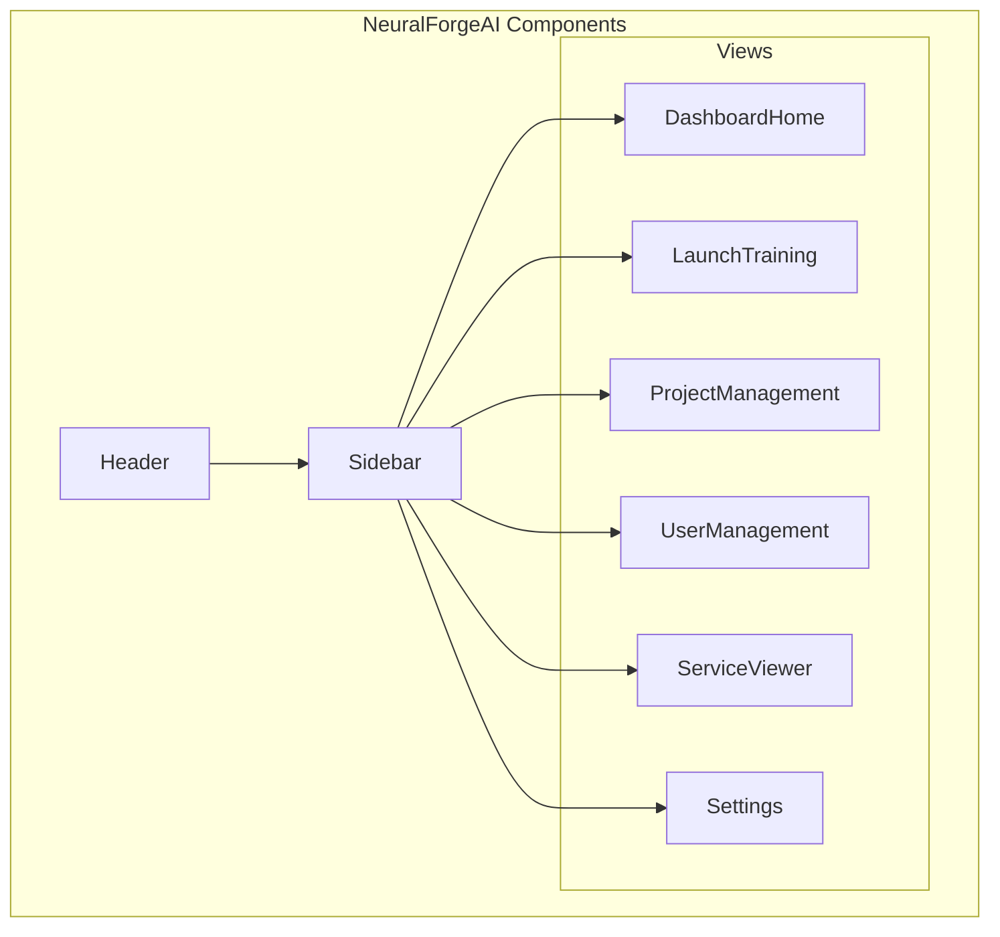

<div align="center">

</div>

# NeuralForgeAI - Frontend React para Control de Entrenamiento ML

Interfaz de usuario moderna y elegante construida en **React** que permite a los usuarios lanzar estudios de entrenamiento de modelos YOLO de forma visual e intuitiva.

## Arquitectura del Sistema


```mermaid
graph TD
    subgraph "NeuralForgeAI (Frontend)"
        UI[React App<br/>:3000]
        STATE[State Management]
        API[API Client]
    end

    subgraph "Backend Services"
        API_GW[Control Server<br/>FastAPI :8000]
        GRADIO[Gradio Interface<br/>:7860]
    end

    subgraph "ML Cluster"
        MGR[Manager<br/>Optuna]
        INV[Invokers<br/>Celery Workers]
        WORK[Workers GPU<br/>Docker]
    end

    subgraph "Infrastructure"
        R[(Redis<br/>:23437)]
        PG[(PostgreSQL<br/>:23436)]
        ML[(MLflow<br/>:23435)]
    end

    UI --> STATE
    STATE --> API
    API --> API_GW
    API_GW --> R
    R --> MGR
    R --> INV
    INV --> WORK
    WORK --> PG
    WORK --> ML
```

## Flujo de Usuario


```mermaid
sequenceDiagram
    participant U as Usuario
    participant UI as NeuralForgeAI
    participant API as Control Server
    participant MGR as Manager
    participant INV as Invoker

    U->>UI: 1. Selecciona Proyecto
    U->>UI: 2. Sube config_train.yaml
    UI->>UI: 3. Valida YAML<br/>(model, train, sweeper)
    
    rect rgb(200, 255, 200)
        note over UI: Validación Exitosa
        UI->>API: 4. POST /train<br/>(config, mode, priority)
        API->>API: 5. Valida y procesa
        API->>MGR: 6. Envia a cola managers
    end
    
    UI->>U: 7. Study ID<br/>confirmación
    
    rect rgb(255, 240, 200)
        note over MGR,INV: Ejecución en background
        MGR->>MGR: Optuna optimization
        MGR->>INV: Envía trials
        INV->>INV: Docker run executor
    end
    
    U->>UI: 8. Consulta estado<br/>(Study ID)
    UI->>API: GET /status/{study_id}
    API-->>UI: Estado + best_params
    UI->>U: Muestra resultados
```

## Componentes Principales


```mermaid
graph TB
    subgraph "NeuralForgeAI Components"
        H[Header]
        S[Sidebar]
        
        subgraph "Views"
            D[DashboardHome]
            L[LaunchTraining]
            P[ProjectManagement]
            U[UserManagement]
            SV[ServiceViewer]
            SE[Settings]
        end
    end

    H --> S
    S --> D
    S --> L
    S --> P
    S --> U
    S --> SV
    S --> SE
```

## Características

- **Gestión de Proyectos**: Crear y administrar proyectos de entrenamiento
- **Lanzamiento de Estudios**: Subir archivos YAML y lanzar estudios de optimización
- **Monitoreo en Tiempo Real**: Ver estado de workers y tareas
- **Gestión de Usuarios**: Control de acceso multi-usuario
- **Configuración Flexible**: Modo público o privado (workers específicos)

## Configuración de Archivo YAML

```yaml
# Configuración de entrenamiento
model: "yolov8n-cls.pt"

train:
  data: /datasets/clasificacion/colorball/
  epochs: 20
  imgsz: 640

# Optimización de hiperparámetros
sweeper:
  study_name: "mi_clasificador"
  n_trials: 5
  search_space:
    model: ["choice", "yolov8n-cls.pt", "yolo11s-cls.pt"]
    train:
      imgsz: ["choice", 416, 512, 640]
      lr0: ["loguniform", 1e-5, 1e-2]
```

## Uso

### Desarrollo Local

```bash
# Instalar dependencias
npm install

# Configurar variables de entorno
cp .env.local.example .env.local
# Editar GEMINI_API_KEY

# Iniciar servidor de desarrollo
npm run dev
```

### Docker

```bash
# Construir imagen
docker build -t neuralforgeai:latest .

# Ejecutar
docker run -p 3000:3000 neuralforgeai:latest
```

## Integración con API

NeuralForgeAI se comunica con el **Control Server** (FastAPI):

| Endpoint | Método | Descripción |
|----------|--------|-------------|
| `/train` | POST | Lanzar estudio de entrenamiento |
| `/workers` | GET | Listar workers activos |
| `/status/{study_id}` | GET | Consultar estado de estudio |
| `/tasks` | GET | Listar tareas en cola |

## Monitoreo Complementario

Además de NeuralForgeAI, puedes monitorear el sistema con:

| Servicio | URL | Propósito |
|----------|-----|-----------|
| **MLflow** | http://localhost:23435 | Tracking de experimentos |
| **Optuna Dashboard** | http://localhost:8080 | Visualización de estudios |
| **Gradio Interface** | http://localhost:7860 | Interfaz alternativa |

---

## Ejecutar y desplegar tu app de IA Studio

Este repositorio contiene todo lo que necesitas para ejecutar tu aplicación localmente.

Ver tu app en AI Studio: https://ai.studio/apps/drive/10sBumsoNRAc51KluE3lSrCQtyS5InvF3

## Prerequisites

- Node.js 18+

## Inicio Rápido

1. Instalar dependencias:
   `npm install`
2. Configurar `GEMINI_API_KEY` en [.env.local](.env.local)
3. Ejecutar la app:
   `npm run dev`

---

**William R.** - AI Leader & Solutions Architect
