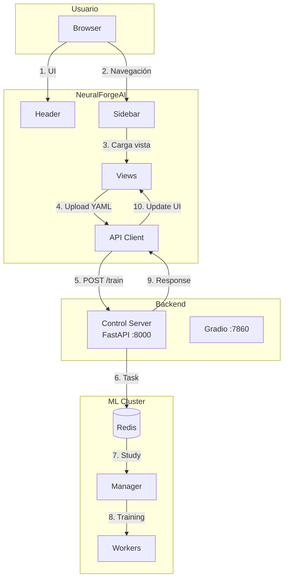
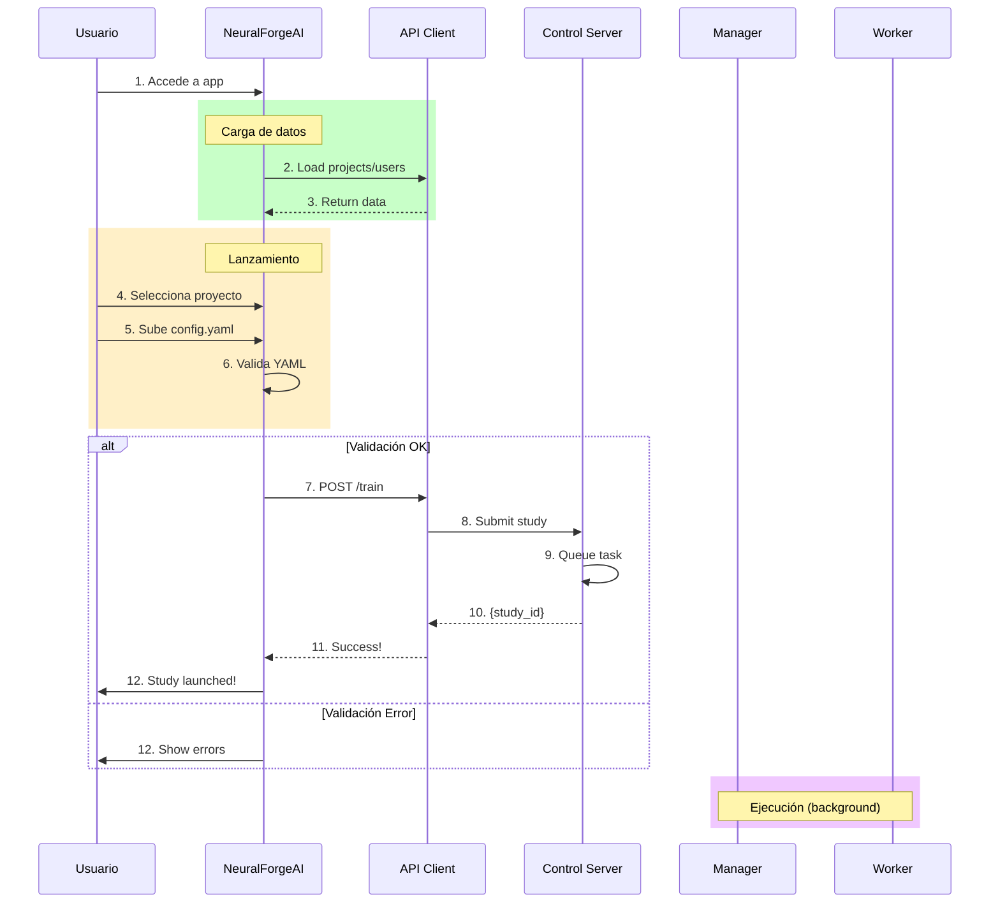
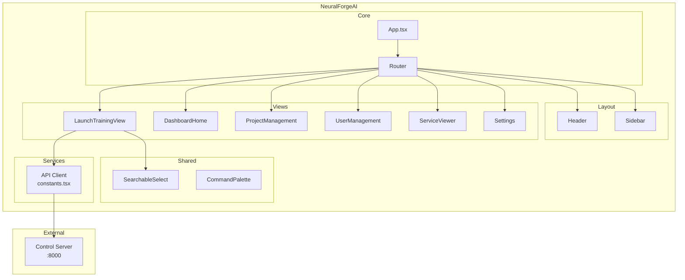

# NeuralForgeAI - React Frontend Interface

Interfaz de usuario moderna construida en **React** que permite a los usuarios lanzar estudios de entrenamiento de modelos YOLO de forma visual e intuitiva. Es el **punto de entrada visual** al cluster NeuralForgeAI.

---

## 1. 🚶 Diagram Walkthrough


```mermaid
flowchart TD
    subgraph "Usuario"
        B[Browser]
    end

    subgraph "NeuralForgeAI"
        H[Header]
        S[Sidebar]
        V[Views]
        A[API Client]
    end

    subgraph "Backend"
        API[Control Server<br/>FastAPI :8000]
        G[Gradio :7860]
    end

    subgraph "ML Cluster"
        R[(Redis)]
        M[Manager]
        W[Workers]
    end

    B -->|1. UI| H
    B -->|2. Navegación| S
    S -->|3. Carga vista| V
    V -->|4. Upload YAML| A
    A -->|5. POST /train| API
    API -->|6. Task| R
    R -->|7. Study| M
    M -->|8. Training| W
    
    API -->|9. Response| A
    A -->|10. Update UI| V
```

**Flujo Principal:**
1. Usuario accede a la interfaz en navegador
2. Navega usando Sidebar
3. Selecciona vista de lanzamiento
4. Sube archivo YAML de configuración
5. API Client envía a Control Server
6. Control Server encola estudio
7. Retorna Study ID
8. Interfaz muestra confirmación

---

## 2. 🗺️ System Workflow


```mermaid
sequenceDiagram
    participant U as Usuario
    participant UI as NeuralForgeAI
    participant C as API Client
    participant API as Control Server
    participant M as Manager
    participant W as Worker

    U->>UI: 1. Accede a app
    
    rect rgb(200, 255, 200)
        note over UI: Carga de datos
        UI->>C: 2. Load projects/users
        C-->>UI: 3. Return data
    end
    
    rect rgb(255, 240, 200)
        note over UI: Lanzamiento
        U->>UI: 4. Selecciona proyecto
        U->>UI: 5. Sube config.yaml
        UI->>UI: 6. Valida YAML
    end
    
    alt Validación OK
        UI->>C: 7. POST /train
        C->>API: 8. Submit study
        API->>API: 9. Queue task
        API-->>C: 10. {study_id}
        C-->>UI: 11. Success!
        UI->>U: 12. Study launched!
    else Validación Error
        UI->>U: 12. Show errors
    end
    
    rect rgb(240, 200, 255)
        note over M,W: Ejecución (background)
    end
```

---

## 3. 🏗️ Architecture Components


```mermaid
graph TB
    subgraph "NeuralForgeAI"
        subgraph "Core"
            A[App.tsx]
            R[Router]
        end
        
        subgraph "Layout"
            H[Header]
            SB[Sidebar]
        end
        
        subgraph "Views"
            LH[LaunchTrainingView]
            DH[DashboardHome]
            PM[ProjectManagement]
            UM[UserManagement]
            SV[ServiceViewer]
            ST[Settings]
        end
        
        subgraph "Shared"
            SS[SearchableSelect]
            CP[CommandPalette]
        end
        
        subgraph "Services"
            AC[API Client<br/>constants.tsx]
        end
    end

    subgraph "External"
        CS[Control Server<br/>:8000]
    end

    A --> R
    R --> H
    R --> SB
    R --> LH
    R --> DH
    R --> PM
    R --> UM
    R --> SV
    R --> ST
    LH --> SS
    LH --> AC
    AC --> CS
```

### Componentes Clave

| Componente | Descripción |
|------------|-------------|
| **App.tsx** | Componente raíz con Router |
| **Header** | Barra superior con usuario |
| **Sidebar** | Navegación lateral |
| **LaunchTrainingView** | Vista principal de lanzamiento |
| **DashboardHome** | Panel de control |
| **API Client** | Cliente REST configurado |
| **SearchableSelect** | Selector con búsqueda |

---

## 4. ⚙️ Container Lifecycle

### Build Process

1. **Base Image**: Node.js slim
2. **Dependencies**: Instala React, TypeScript, Tailwind
3. **Code Copy**: Copia src/ y public/
4. **Build**: Ejecuta `npm run build`
5. **Serve**: Configura servidor static

### Runtime Process

1. **Port Exposure**: Expone puerto 3000
2. **Env Loading**: Carga variables de entorno
3. **API Config**: Configura URL del Control Server
4. **Component Mount**: Monta React app
5. **API Fetch**: Carga proyectos/usuarios iniciales
6. **Ready**: UI disponible para usuario

---

## 5. 📂 File-by-File Guide

| Archivo/Carpeta | Propósito |
|-----------------|-----------|
| `App.tsx` | Componente raíz y routing |
| `constants.tsx` | Configuración API |
| `components/Header.tsx` | Barra superior |
| `components/Sidebar.tsx` | Navegación lateral |
| `components/LaunchTrainingView.tsx` | Vista de lanzamiento |
| `components/DashboardHome.tsx` | Panel principal |
| `components/ProjectManagementView.tsx` | Gestión proyectos |
| `components/UserManagementView.tsx` | Gestión usuarios |
| `components/ServiceViewer.tsx` | Visor de servicios |
| `components/SettingsView.tsx` | Configuración |
| `components/SearchableSelect.tsx` | Componente selector |
| `components/CommandPalette.tsx` | Paleta de comandos |
| `package.json` | Dependencias Node.js |
| `Dockerfile` | Imagen del contenedor |

---

## Configuración

```typescript
// constants.tsx
export const UPLOAD_API_CONFIG = {
  url: "http://localhost:8000/train",
  method: "POST",
};
```

### Variables de Entorno

```bash
REACT_APP_API_URL=http://localhost:8000
REACT_APP_GEMINI_API_KEY=your_key
```

---

## Uso

### Desarrollo

```bash
npm install
npm run dev
```

### Producción

```bash
npm run build
docker build -t neuralforgeai:v1.0.0 .
docker run -p 3000:3000 neuralforgeai:v1.0.0
```

---

## Vistas Principales

| Vista | Descripción |
|-------|-------------|
| **DashboardHome** | Panel principal con stats |
| **LaunchTraining** | Lanzar estudios de entrenamiento |
| **ProjectManagement** | Gestionar proyectos |
| **UserManagement** | Gestionar usuarios |
| **ServiceViewer** | Ver estado de servicios |
| **Settings** | Configuración de la app |

---

**William R.** - AI Leader & Solutions Architect
